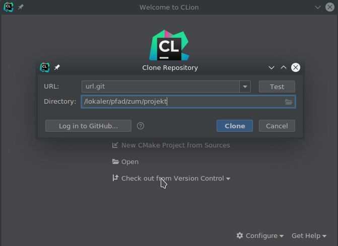
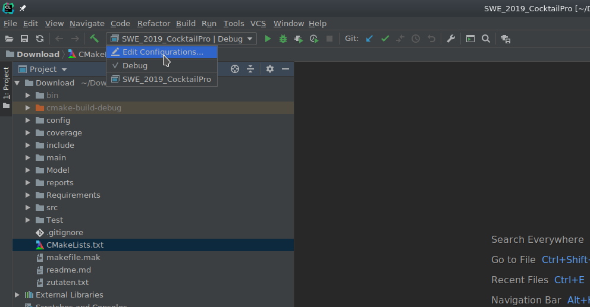
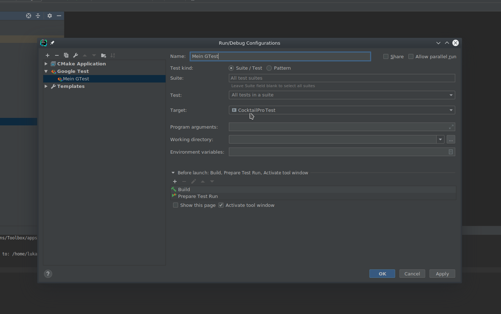

# CocktailPro Legacy

Im Jahr 2015 wurde eine Software zur Simulation eines Cocktail-Misch-Geräts entwickelt: der **"CocktailPro"**. Die Software wurde aber als Prototyp und nicht für einen dauerhaften Betrieb entwickelt. Deshalb enthält der Code praktisch keine Kommentare und leider auch keine sonstige Dokumentation. Auch kleinere Fehler sind bekannt, wurden aber nie behoben.
Nun soll die Software von Ihnen weiterentwickelt werden, allerdings so, dass die üblichen Qualitätsansprüche an eine "ernst gemeinte" Software erfüllt sind. 
Sie erhalten den vollständigen und kompilierbaren Code des CocktailPro's. 
Ihre Aufgabe im gesamten Praktikum besteht darin, das System wartbarer zu machen und um neue Funktionen zu erweitern.

### Voraussetzungen

Die Entwicklung des Codes erfolgt unter Verwendung von Git. In diesem Projekt verwenden wir Jenkins als Continuous Integration Server. Jenkins lädt Ihre Quellcode-Dateien automatisch aus Ihrem Git-Repository.
(Innerhalb des Hochschulnetzwerks können Sie den Jenkins-Server einfach aufrufen. Von außerhalb der Hochschule müssen Sie eine VPN-Verbindung verwenden.) 

Um die Software weiterentwickeln zu können, brauchen Sie entsprechende Software. Auf den Laborrechnern ist diese vorhanden, auf Ihrem Privatrechner müssen Sie die Software eventuell noch installieren

- **Git** (https://git-scm.com) und

- evtl. ein **grafischer Git-Client** (z.B. https://tortoisegit.org/)

- **VPN-Software** (z.B. https://github.com/openconnect/openconnect-gui/releases)   
Als Gateway müssen Sie https://firewall.fbi.h-da.de eintragen, als Protokoll Cisco Anyconnect und als Usernamen Ihren st-Account

- **Gnu-Compiler g++**, **make**, **gdb** und **cmake** (Für Windows Cygwin: https://www.cygwin.com/)

- **CLion** (https://www.jetbrains.com/clion/    
Auf den Laborrechnern verwenden Sie eine Hochschullizenz; für Ihren Privatrechner brauchen Sie eine (kostenlose) Lizenz für Studierende von Jetbrains. Dazu müssen Sie sich bei JetBrains registrieren.

## Entwicklung in CLion
Um das Projekt weiterentwickeln und Tests erstellen zu können, müssen Sie das Projektverzeichnis auf Ihren lokalen Rechner "clonen". Dazu verwenden wir die IDE "CLion" von Jetbrains. Öffnen Sie CLion, geben Sie bei erstmaligem öffnen Ihre Nutzerdaten ein und klicken Sie sich durch den Wizard. Klicken Sie anschließend auf **Check out from Version Control** und **git** um ein Projekt von git zu clonen. Geben Sie dort die URL zum git Repository und den Speicherort des Projekts an (siehe Screenshot). Anschließend öffnen Sie das Projekt (Sie werden nach dem Aus-Checken gefragt, ob das Projekt geöffnet werden soll).

CLion erkennt dann automatisch die vorhandene Konfiguration Ihres Rechners und passt das Projekt entsprechend an. Nach einer Weile können Sie das Projekt **CocktailPro** bauen und ausführen.

### Google Tests

Für das Ausführen der Google Tests in CLion, müssen Sie eine **Google Test Configuration** anlegen. Klicken Sie hierzu oben in der Leiste auf die Konfiguration und wählen Sie **Edit Configurations** aus (siehe Screenshot).

Anschließend klicken Sie oben rechts auf das **+**, wählen **Google Test** aus und stellen bei **Target** auf **CocktailProTest** (siehe Screenshot).

Nun können Sie über die Konfiguration leicht wählen, ob Sie den ausführbaren CocktailPro oder die Google Tests übersetzen oder ausführen wollen.

## Viel Erfolg mit dem CocktailPro!

Ralf Hahn

Stefan T. Ruehl
